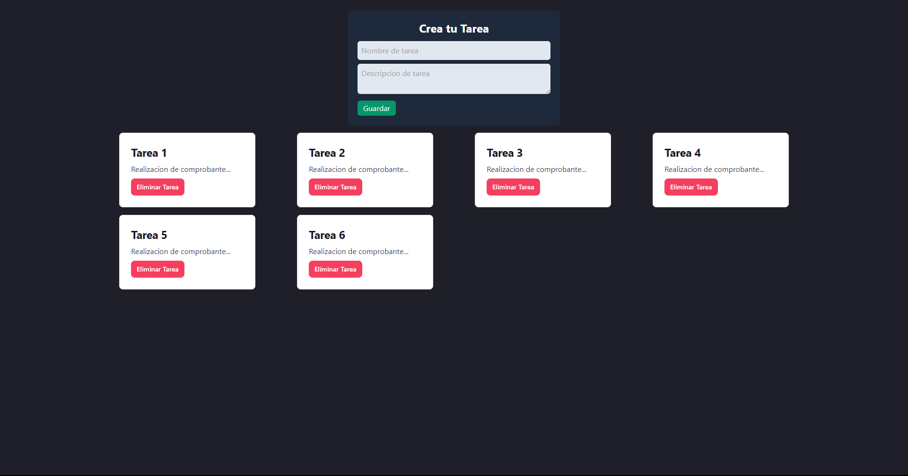

# Proyect-React-Tasks
Pagina para la creacion de mini tareas.


## Importante 
Debera instalar dentro de la carpeta de la aplicación mediante el CMD lo que sale a continuacion:

```bash
npm install 
```
Luego para iniciar la Pagina en CMD tendra que escribir:

```bash
npm run dev
```




